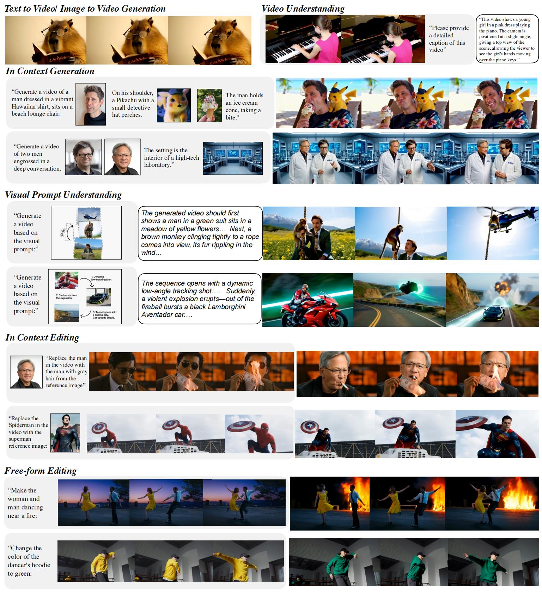

<p align="center" >
    
</p>

# <div align="center" >UniVideo: Unified Understanding, Generation, and Editing for Videos<div align="center">


<div align="center">

**[Cong Wei<sup>*,1,2</sup>](https://congwei1230.github.io/) &ensp;
[Quande Liu<sup>†,2</sup>](https://liuquande.github.io/) &ensp;
[Zixuan Ye<sup>2</sup>](https://openreview.net/profile?id=~Zixuan_Ye1) &ensp; 
[Qiulin Wang<sup>2</sup>](https://scholar.google.com/citations?user=3vvZdy8AAAAJ&hl=en) &ensp;
[Xintao Wang<sup>2</sup>](https://xinntao.github.io/)**

**[Pengfei Wan<sup>2</sup>](https://magicwpf.github.io/) &ensp;
[Kun Gai<sup>2</sup>](https://openreview.net/profile?id=~Kun_Gai1) &ensp;
[Wenhu Chen<sup>†,1</sup>](https://wenhuchen.github.io/)**
  <p>
    <sup>1</sup>University of Waterloo &nbsp;&nbsp;
    <sup>2</sup>Kling Team, Kuaishou Technology<br>
    <sup>*</sup>Work done during an internship at Kling Team, Kuaishou Technology
    <sup>†</sup>Corresponding author
  </p>
</div>

<p align="center">
  <a href='https://congwei1230.github.io/UniVideo/'></a>
  &nbsp;
  <a href="https://arxiv.org/abs/2510.08377"></a>
  &nbsp;
  <a href='https://huggingface.co/KlingTeam/UniVideo'></a>
</p>


<p align="center"></p>

## 🚀 Supported Tasks

Univideo is flexible in its input and output configurations, supporting a wide range of multimodal tasks:

| Task | Input Type | Output | Task ID | Description |
| :--- | :--- | :--- | :--- | :--- |
| **Image/Video Understanding** | Image🖼️/Video🎬 + Text📝 | Text📝 | `understanding` | Multimodal analysis and captioning. |
| **Text-to-Image** | Text📝 | Image🖼️ | `t2i` | Generating images from text prompts. |
| **Text-to-Video** | Text📝 | Video🎬 | `t2v` | Generating videos from text prompts. |
| **Image-to-Video** | Image🖼️ + Text📝 | Video🎬 | `i2v` | Animating a static image into a video. |
| **Image Editing** | Image🖼️ + Text📝 | Image🖼️ | `i2i_edit` | Instruction-based image editing. |
| **In-context Image Editing** | Image🖼️ + Image🖼️ + Text📝 | Image🖼️ | `i+i2i_edit` | Editing an image based on a reference image. |
| **In-context Generation** | Image🖼️ $\times N$ + Text📝 | Image🖼️/Video🎬 | `multiid` | Multi-subject generation. |
| **Video Editing** | Video🎬 + Text📝 | Video🎬 | `v2v_edit` | Instruction-based video manipulation and stylization |
| **In-context Video Editing** | Image🖼️ + Video🎬 + Text📝 | Video🎬 | `i+v2v_edit` | Reference-based manipulation: addition, deletion, swapping, and stylization. |


## 🔔News
- [2026-01-30]: UniVideo was accepted at ICLR 2026 🎉
- [2026-01-07]: Released [Code](https://github.com/KlingTeam/UniVideo) and [Model](https://huggingface.co/KlingTeam/UniVideo).
- [2025-10-09]: Released [Arxiv Preprint](https://arxiv.org/abs/2510.08377) and the [Project Page](https://congwei1230.github.io/UniVideo/)


## How to use

### 1. Installation

```
conda env create -f environment.yml
conda activate univideo
```

This environment is tested with:
- Python 3.11
- PyTorch 2.4.1 + CUDA 12.1
- diffusers 0.34.0
- transformers 4.51.3

### 2. Download Checkpoint

Download the [Univideo checkpoint](https://huggingface.co/KlingTeam/UniVideo) to a local path for example `ckpts/`:

```
python download_ckpt.py
```

We provide two UniVideo checkpoint variants as described in Arxiv Preprint Section 3.2:

- **Variant 1 (img, video, txt -> mllm -> last layer hidden -> mmdit)**  
  Image, video, and text inputs are processed by the MLLM, and the final hidden states are fed into the MMDiT backbone.

- **Variant 2 (img, video, txt, queries -> mllm -> txt + queries last layer hidden -> mmdit)**  
  Image, video, text, and queries are processed by the MLLM. The final hidden states of text and queries are used as inputs to MMDiT.

### 3. Inference

We provide demo inference scripts to demonstrate how to load and run the UniVideo pipeline by setting up `pipeline_kwargs` on different inputs. Feel free to adapt these to your own inputs and setup.

#### 1. Basic Understanding & Generation
```bash
# Image/Video Captioning & Understanding
python univideo_inference.py --demo_task understanding --config configs/univideo_qwen2p5vl7b_hidden_hunyuanvideo.yaml

# Text-to-Video (T2V)
python univideo_inference.py --demo_task t2v --config configs/univideo_qwen2p5vl7b_hidden_hunyuanvideo.yaml

# Text-to-Image (T2I)
python univideo_inference.py --demo_task t2i --config configs/univideo_qwen2p5vl7b_hidden_hunyuanvideo.yaml

# Image-to-Video (I2V)
python univideo_inference.py --demo_task i2v --config configs/univideo_qwen2p5vl7b_hidden_hunyuanvideo.yaml
```

#### 2. Instruction-based Editing
```bash
# Image Editing 
python univideo_inference.py --demo_task image_edit --config configs/univideo_qwen2p5vl7b_hidden_hunyuanvideo.yaml

# Video Editing
python univideo_inference.py --demo_task video_edit --config configs/univideo_qwen2p5vl7b_hidden_hunyuanvideo.yaml

# Video Stylization
python univideo_inference.py --demo_task stylization --config configs/univideo_qwen2p5vl7b_hidden_hunyuanvideo.yaml
```


#### 3. In-Context Tasks

```Bash
# In context video generation
python univideo_inference.py --demo_task in_context_video_gen --config configs/univideo_qwen2p5vl7b_hidden_hunyuanvideo.yaml

# In context image editing
python univideo_inference.py --demo_task in_context_image_edit --config configs/univideo_qwen2p5vl7b_hidden_hunyuanvideo.yaml

# In context video editing
## addition
python univideo_inference.py --demo_task in_context_video_edit_addition --config configs/univideo_qwen2p5vl7b_hidden_hunyuanvideo.yaml
## swap
python univideo_inference.py --demo_task in_context_video_edit_swap --config configs/univideo_qwen2p5vl7b_hidden_hunyuanvideo.yaml
## style
python univideo_inference.py --demo_task in_context_video_edit_style --config configs/univideo_qwen2p5vl7b_hidden_hunyuanvideo.yaml
```

#### Univideo variant 2
To use the **Queries-based** version of UniVideo, simply update the configuration flag.
```
--config configs/univideo_qwen2p5vl7b_queries_hunyuanvideo.yaml
```


### 4. Evaluation

We provide the scripts for evaluating UniVideo on GenEval, ImgEdit, GEdit and Vbench benchmarks.  Check out [EVAL.md](EVAL.md)

## Acknowledgement

- [HunyuanVideo](https://github.com/Tencent-Hunyuan/HunyuanVideo): the base video generation model used in this work. Thanks to the authors for their excellent contribution.
- [Qwen2.5-VL](https://github.com/QwenLM): the base vlm model used in this work. Thanks to the authors for their excellent contribution.
- [MetaQueries](https://xichenpan.com/metaquery/): we adopt their query implementation. Thanks to the authors for their excellent contribution.

## 🌟 Citation

If you find UniVideo useful for your research and applications, please cite using this BibTeX:

```bibtex
@article{wei2025univideo,
  title={Univideo: Unified understanding, generation, and editing for videos},
  author={Wei, Cong and Liu, Quande and Ye, Zixuan and Wang, Qiulin and Wang, Xintao and Wan, Pengfei and Gai, Kun and Chen, Wenhu},
  journal={arXiv preprint arXiv:2510.08377},
  year={2025}
}
```